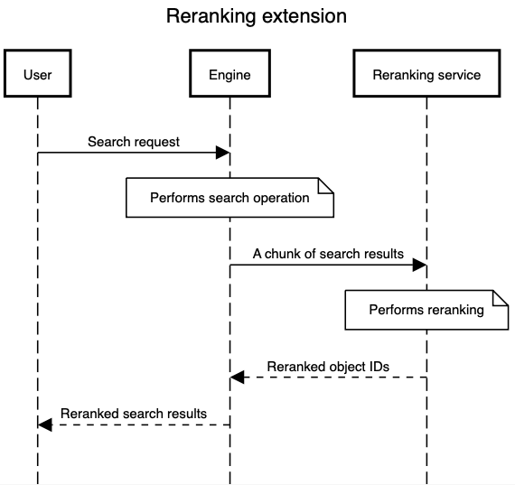
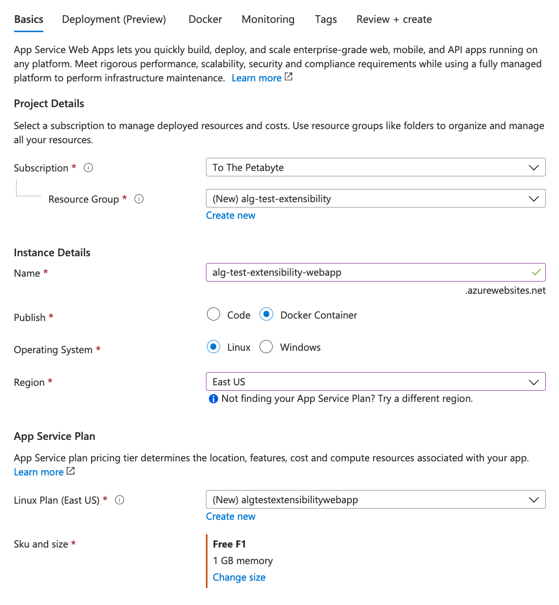
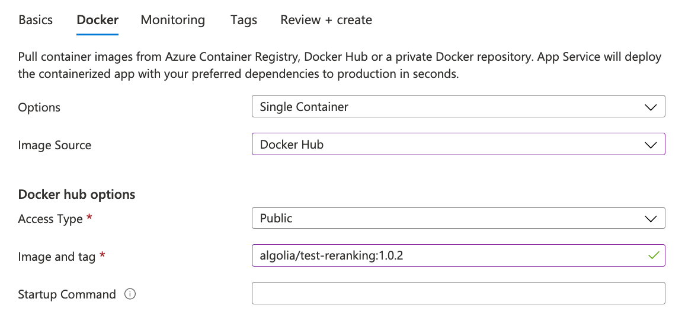
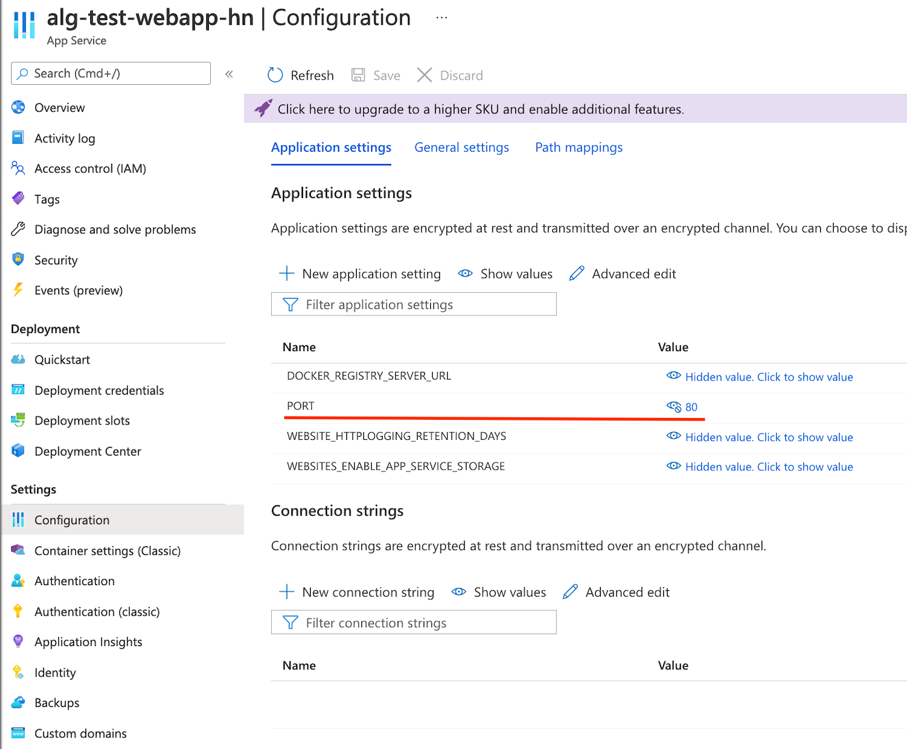

# Reranking extensibility

## What is the reranking extension?

The reranking extension provides the possibility to rerank items based on more than just custom ranking. You can rerank items on a specific logic, for example:

- Custom merchandising (e.g. based on number of impressions)
- Custom personalization strategies
- Custom machine learning models

The reranking extension is a post-processing step for a search request that gives you full control of the final search results ranking.

## How does it work?

The sequence diagram below shows how the reranking extensions works.



- A user triggers a new search
- The engine performs a search and dispatches a specified chunk of results to the reranking extension endpoint
- The reranking service performs reranking and returns the reordered result to the engine
- The engine returns the reordered results to the user

## Setup

The setup of the reranking extension consists of two steps: 

### 1. Create a reranking web service

The reranking is performed by a web-service that should be able to respond to requests on a specific endpoint.
Those requests include minimal information about the records and their ranking criteria.

**Request body example:**

```ts
{
"hits": [
 {
   "objectID": "object-1",
   "_rankingOrderedValues": [
     {
       "criterion": "typo",
       "order": "asc",
       "value": 1
     },
     // ...
     {
       "criterion": "custom",
       "field": "rating",
       "order": "asc",
       "value": "3"
     }
   ]
 },
 // ...
]
}
```

The response should include the same hits, in their new order.
Each hit should only include the `objectID`.

**Expected response**

```ts
{
 "hits": [
   { "objectID": "object-2" },
   { "objectID": "object-1" },
   // ...
 ]
}
```

For performance and cost reasons, your web services should be hosted as close as possible to your Algolia application. 

We provide an example of the reranking extension service within a Docker container which is available on the [Docker Hub](https://hub.docker.com/r/algolia/test-reranking).

It is a Node.js application that listens to HTTP requests, extracts the `hits` list and reorders it accordingly with the reranking logic. 
The source code of this application can be found in the [index.js](/Docker/index.js) file.
The essential part of this application is the `rerank` function which takes the list of hits as a parameter and returns the reordered list of hits as a result.
In our example it sorts the hits by `salesRank` criteria in ascending order.

```ts
function rerank(hits) {
  function sortBySalesRank(a, b) {
    if (a.salesRank < b.salesRank) {
      return -1;
    }
    if (a.salesRank > b.salesRank) {
      return 1;
    }  
    return 0;
  }

  hits.sort(sortBySalesRank);

  return hits
}
```

You can replace this function with a one that matches your use case.

### 2. Set the reranking endpoint in the settings 

Set `extensions.reranking` setting in your index: <-- link to the API clients documentation? /-->

```ts
{
  "extensions": {
    "reranking": {
      "enabled": true,                                 // Activates the feature
      "endpoint": "https://example.org/my-endpoint",   // URL to target
      "maxNbHits": 100                                 // Amount of hits to rerank
    }
  }
}
```


## Getting started reranking extension with Azure

This guide requires to have a Docker image ready to deploy.
The [source code for the example Docker image](/Docker) is available and deployed publicly on [Docker Hub](https://hub.docker.com/r/algolia/test-reranking).
This image starts a webserver on `$PORT` (set through environment variables). It expects requests as described above, and returns `objectID`s in the reverse order they were sent.

<br/>
<br/>

- Click `Create resource` button



- In the provided list of resources select "Web app"
  - Select a resource group or create a new one if needed
  - Input the app name
  - Select `Docker container` on `Linux` operating system
  - Choose the region
  - Choose a service plan and click **Next**

<br/>
<br/>
<br/>
<br/>
<br/>
<br/>
<br/>
<br/>
<br/>
<br/>
<br/>
<br/>
<br/>
<br/>
<br/>
<br/>
<br/>
<br/>
<br/>



- In the Docker setup
  - Select the `Single Container` option
  - Select `Docker Hub` as the image source
  - Select `Public` visibility
  - Set `Image and tag` field with `algolia/test-reranking:1.0.2`
  - Click the **Review + create** button. The validation of the app will take some time.
 
<br/>
<br/>
<br/>

- Once the validation passed, click `Create` button and wait until the deployment finished.
- Open the created resource by clicking the **Go to resource** button.

<br/>




- Select `Settings` -> `Configuration`
- Click **New application setting**
- Set name to `PORT` and value to `80`, click **OK** and then **Save**
- You're all set. Go to the `Overview` section. You can find the URL of your application which can be used as the endpoint in the index settings.

<br/>
<br/>
<br/>
<br/>
<br/>
<br/>
<br/>


#### Getting started reranking extension with GCP

TODO:

#### Getting started reranking extension with AWS

TODO:
