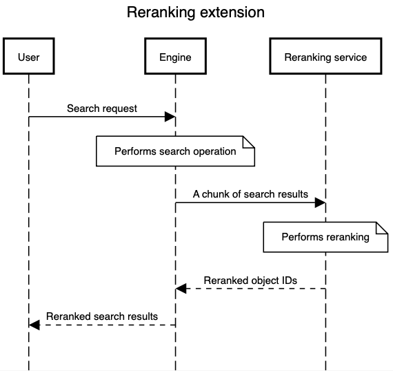
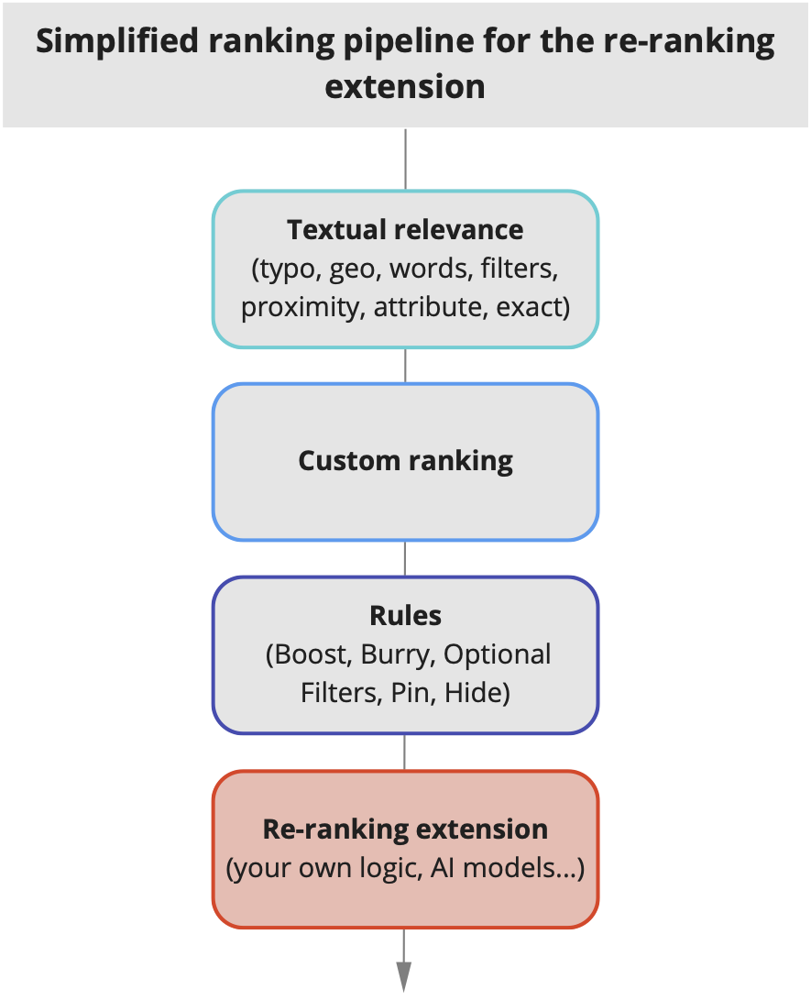
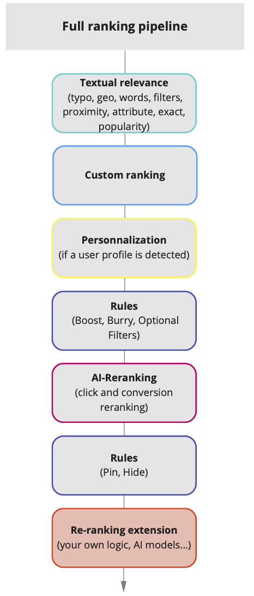

> :warning: Please note that the reranking extension feature is in closed beta phase.

# Reranking extensibility

## What is the reranking extension?

The reranking extension provides the possibility to rerank your search results based on your specific logic, for example reranking using:

- A custom diversification and merchandising strategy (e.g. based on number of impressions)
- A custom personalization strategy (e.g using a query time computed user score)
- A custom machine learning model (e.g using a semantic reranker)

The reranking extension is a post-processing step for a search request that gives you more control on the final search results ranking.

## How does it work?

The sequence diagram below shows how the reranking extensions works.

- A user triggers a new search
- The engine performs a search and sends a specified chunk of results to the reranking extension endpoint
- The reranking service performs the reranking and returns the reordered result list to the engine
- The engine performs the highlighting and pagination before returning the reordered results to the user

The reranking extension joins the existing ranking pipeline as the last step of the tie-breaking algorithm.

If you have activated the advanced ranking features such as AI-reranking and Personalization, the resulting ranking pipeline will look as follows:

[Reranking setup guide](docs/setup.md)
