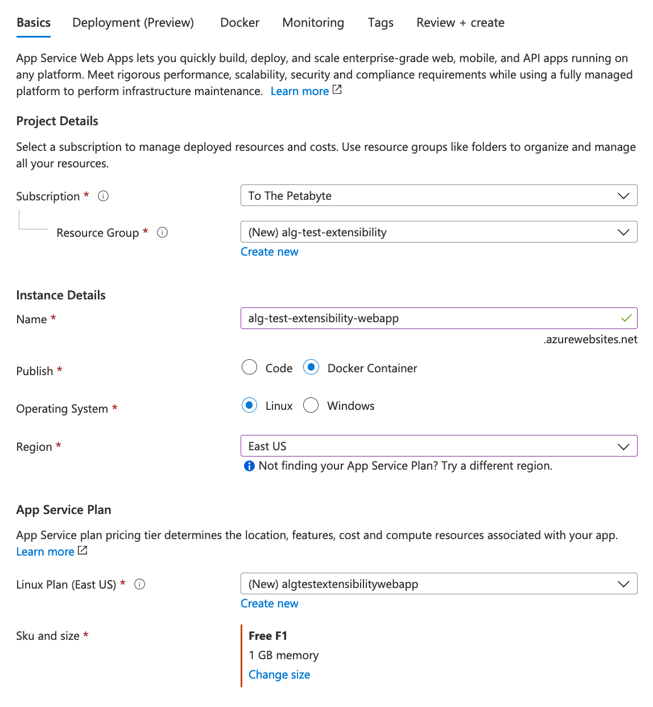
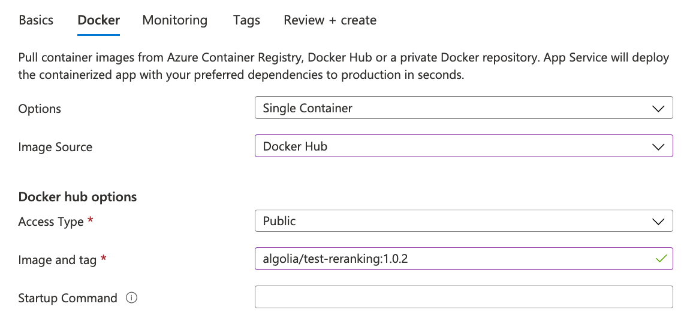
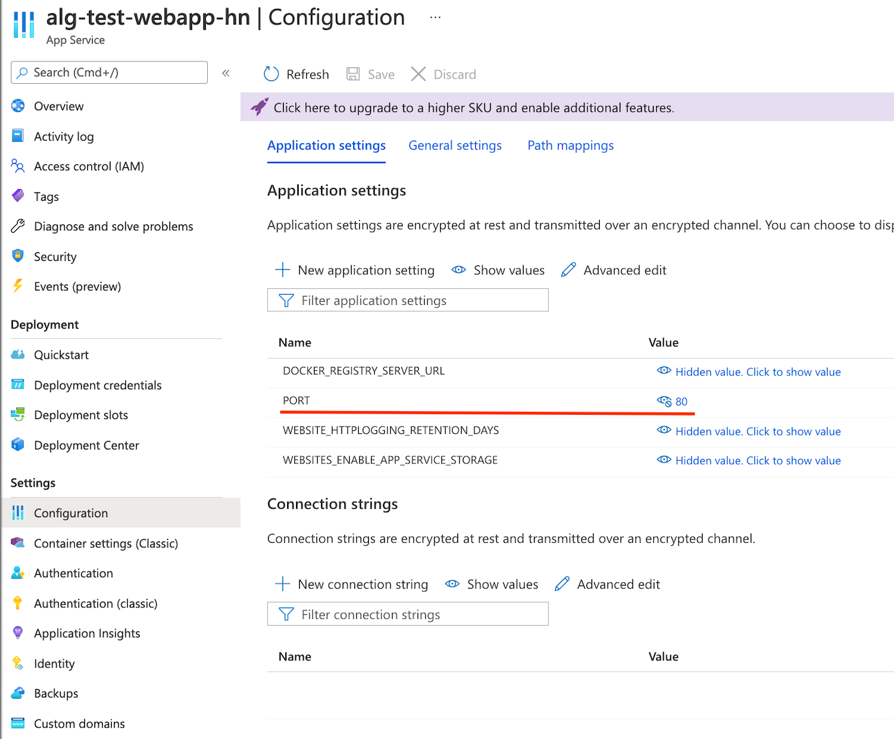

## Setup

The setup of the reranking extension consists of two steps:

### 1. Create a reranking web service

The reranking is performed by a web-service that should be able to respond to requests on a specific endpoint.
Those requests include minimal information about the records and their ranking criteria.

**Request body example:**

```ts
{
  "hits": [
    {
      "objectID": "object-1",
      "_rankingOrderedValues": [
        {
          "criterion": "typo",
          "order": "asc",
          "value": 1
        },
        // ...
        {
          "criterion": "custom",
          "field": "rating",
          "order": "asc",
          "value": "3"
        }
      ]
    }
    // ...
  ]
}
```

The response should include the same hits, in their new order.
Each hit should only include the `objectID`.

**Expected response**

```ts
{
  "hits": [
    { "objectID": "object-2" },
    { "objectID": "object-1" }
    // ...
  ]
}
```

For performance and cost reasons, your web services should be hosted as close as possible to your Algolia application.

We provide an example of the reranking extension service within a Docker container which is available on the [Docker Hub](https://hub.docker.com/r/algolia/test-reranking).

It is a Node.js application that listens to HTTP requests, extracts the `hits` list and reorders it according with the reranking logic.
The source code of this application can be found in the [index.js](/src/index.js) file.
The essential part of this application is the `rerank` function which takes the list of hits as a parameter and returns the reordered list of hits as a result.
In our example it splits the hits into two buckets: cheaper and costlier than $30. The first bucket is sorted by sales rank and the second one is sorted by price. This kind of ranking cannot be achieved through the index settings, so the only way to add such a ranking is to create an extension.

```ts
function rerank(hits) {

 // Replace this implementation with your reranking logic
 function rank(a, b) {

    if (a.price < 30 && b.price >= 30) {
      return -1;
    }

    if (a.price >= 30 && b.price < 30) {
      return 1;
    }

    if (a.price < 30 && b.price < 30) {
      if (a.salesRank < b.salesRank) {
        return -1;
      }
      if (a.salesRank > b.salesRank) {
        return 1;
      }
      return 0;
    } else {
      if (a.price < b.price) {
        return -1;
      }
      if (a.price > b.price) {
        return 1;
      }
      return 0;
    }

  }

  hits.sort(rank);

  return hits;
}
```

Start with cloning this repository. 
Replace the `rerank` function with a one that matches your use case.
Upload the refined extension to your DockerHub repository.

Build your image
```sh
docker build -t reranking-extension .
```

Push it to your Dockerhub account
```sh
docker push <hub-user>/<repo-name>:<tag>
```

### 2. Set the reranking endpoint in the settings

Set `extensions.reranking` setting in your index:

```ts
{
  "extensions": {
    "reranking": {
      "enabled": true, // Activates the feature
      "endpoint": "https://example.org/my-endpoint", // URL to target
      "maxNbHits": 100 // Amount of hits to rerank
    }
  }
}
```

You can access the Metis application using one of the [API clients](https://www.algolia.com/doc/api-client/getting-started/what-is-the-api-client/go/?client=go) we provide.
You have to initialize the search client using the custom configuration in which you should provide the URL of your Metis application as a host.

The example of creation of the search client with a custom configuration using the JS client:

```ts
const client = algoliasearch(
  '$YOUR_METIS_APPLICATION_ID',
  '$YOUR_METIS_APPLICATION_API_KEY',
  {
    hosts: [{ url: '$YOUR_METIS_APPLICATION_URL' }],
  }
);
const index = client.InitIndex('$YOUR_METIS_APPLICATION_INDEX');
```

The reranking extension settings can be set via settings:

```ts
index.setSettings({
  extensions: {
    reranking: {
      enabled: false,
      maxNbHits: 100,
      endpoint: 'https://alg-test-extensibility-webapp.azurewebsites.net',
    },
  },
});
```

Otherwise, you can directly use the `curl` for this purpose.

```sh
curl -X PUT -H 'X-Algolia-Application-Id: %YOUR_METIS_APPLICATION_ID' -H 'X-Algolia-API-Key: %YOUR_METIS_APPLICATION_API_KEY'  --data-binary '{
  "extensions": {
    "reranking": {
      "endpoint": "%YOUR_RERANKING_ENDPOINT_URL",
      "maxNbHits": 100,
      "enabled": true
    }
  }
 }'  "https://%YOUR_METIS_APPLICATION_URL/1/indexes/%YOUR_INDEX_NAME/settings"
```

### 3. Test your extension

Test if your extension works as expected. The extension is enabled by default, so the search operation will directly return the reranked list of hits:

```ts
index.search('').then(({ hits }) => {
  console.log(hits);
});
```

Compare the returned result with a default result returned with deactivated extension:

```ts
index.search('', {
  extensions: {
    reranking: {
      enabled: false,
    }
  }
}).then(({ hits }) => {
  console.log(hits);
});
```

## Getting started reranking extension with Azure

This guide requires to have a Docker image ready to deploy.
The [source code for the example Docker image](/Docker) is available and deployed publicly on [Docker Hub](https://hub.docker.com/r/algolia/test-reranking).
This image starts a webserver on `$PORT` (set through environment variables). It expects requests as described above, and returns `objectID`s in the reverse order they were sent.

<br/>
<br/>

- Click `Create resource` button



- In the provided list of resources select "Web app"
  - Select a resource group or create a new one if needed
  - Input the app name
  - Select `Docker container` on `Linux` operating system
  - Choose the region
    > :warning: Your Metis application and the extension must be hosted in the same region!
  - Choose a service plan and click **Next**

<br/>
<br/>
<br/>
<br/>
<br/>
<br/>
<br/>
<br/>
<br/>
<br/>
<br/>
<br/>
<br/>
<br/>
<br/>
<br/>
<br/>
<br/>
<br/>



- In the Docker setup
  - Select the `Single Container` option
  - Select `Docker Hub` as the image source
  - Select `Public` visibility
  - Set `Image and tag` field with `algolia/test-reranking:1.0.2`
  - Click the **Review + create** button. The validation of the app will take some time.

<br/>
<br/>
<br/>

- Once the validation passed, click `Create` button and wait until the deployment finished.
- Open the created resource by clicking the **Go to resource** button.

<br/>



- Select `Settings` -> `Configuration`
- Click **New application setting**
- Set name to `PORT` and value to `80`, click **OK** and then **Save**
- You're all set. Go to the `Overview` section. You can find the URL of your application which can be used as the endpoint in the index settings.

<br/>
<br/>
<br/>
<br/>
<br/>
<br/>
<br/>
